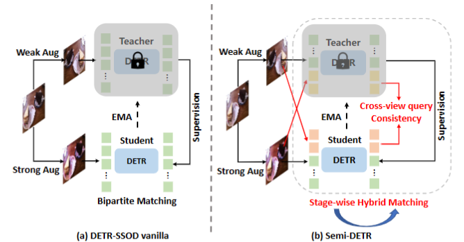

<div align="center">

<h2> Semi-DETR: Semi-Supervised Object Detection with Detection Transformers </h2>

</div>



This repo is the official implementation of CVPR'2023 paper ["Semi-DETR: Semi-Supervised Object Detection with Detection Transformers"](https://arxiv.org/abs/2307.08095). Semi-DETR is the first work on semi-supervised object detection designed for detection transformers.
## Update
- **`2024/08/09`**  We release the prepared conda environment to help run our code. You can download the environment we used from the Google Driver link: [semidetr_miniconda_cuda12.1_torch1.9.0+cu111_mmcv-full1.3.16.tar](https://drive.google.com/file/d/1XoaMtMMVW4_qUGHXEOlEnjnOUaapyWwA/view?usp=drive_link). We have already validated this environment on the Tesle A100 with the latest CUDA driver 12.1 so that you can run our code without annoying bugs about the environments.
  -   **Usage**: Download this environment tar file and then put it into the `envs` directory of your anaconda/miniconda, where anaconda/miniconda manage their virtual envs. Then unzip this file, and execute `conda init` to make the env prepared. Note that sometimes you are required to modify the PYTHON interpreter path in some files under this env to make it work correctly, such as setting the PYTHON interpreter in the `semidetr/bin/pip` to your local path to make the pip work properly.
-  **`2024/08/09`** We reshare our model weight files via Google Driver, you can download these files via the following links:
    - [Semi-DETR COCO 1\%(Google Driver)](https://drive.google.com/file/d/1guWr-7Klvt8w16on082JUPdnsPBv8b_D/view?usp=drive_link)
    - [Semi-DETR COCO 5\%(Google Driver)](https://drive.google.com/file/d/1R7FfkOkiR57WSleKJmHj2BitVj_xfqam/view?usp=drive_link)
    - [Semi-DETR COCO 10\%(Google Driver)](https://drive.google.com/file/d/1gYBzI_SANfl9_HqklzWJ_hBE55Gh4wnI/view?usp=drive_link)
    - [Semi-DETR COCO Full(Google Driver)](https://drive.google.com/file/d/17OPojkoIU7wwRcT4xNuuXONNy4zIymA4/view?usp=sharing)
    - [Semi-DETR PASCAL VOC(Google Driver)](https://drive.google.com/file/d/1oLyyrRT5GqHyo40I-4BQjnURLJFXAQ5Q/view?usp=sharing)
  - **`2024/11/26`** We upload the supervised baseline to Google Driver as requested:
    - [DINO-MMDet 12 epoch(Google Driver)](https://drive.google.com/file/d/12EvorMAW4PCZllctx4QphP2j8eUoJteB/view?usp=sharing)
   
## Usage
Our code is based on the awesome codebase provided by Soft-Teacher[1].

### Requirements
- `Ubuntu 18.04`
- `Anaconda3` with `python=3.8`
- `Pytorch=1.9.0`
- `mmdetection=2.16.0+fe46ffe`
- `mmcv=1.3.16`
- `cuda=10.2`

<!-- #### Notes
- The project should be compatible to the latest version of `mmdetection`. If you want to switch to the same version `mmdetection` as ours, run `cd thirdparty/mmdetection && git checkout v2.16.0` -->
### Installation
Ths project is developed based on mmdetection, please install the mmdet in a editable mode first:
```
cd thirdparty/mmdetection && python -m pip install -e .
```
Following the mmdetection, we also develop our detection transformer module and semi-supervised module in the similar way, which needs to be installed first(Please change the module name('detr_od' and 'detr_ssod') in 'setup.py' file alter):
```
cd ../../ && python -m pip install -e .
```
These will install 'mmdet', 'detr_od' and 'detr_ssod' in our environment.
It also needs to compile the CUDA ops for deformable attention:
```
cd detr_od/models/utils/ops
python setup.py build install
# unit test (should see all checking is True)(Optional)
python test.py
cd ../../..
```
### Data Preparation
- Download the COCO dataset
- Execute the following command to generate data set splits:
```shell script
# YOUR_DATA should be a directory contains coco dataset.
# For eg.:
# YOUR_DATA/
#  coco/
#     train2017/
#     val2017/
#     unlabeled2017/
#     annotations/
ln -s ${YOUR_DATA} data
bash tools/dataset/prepare_coco_data.sh conduct

```
For concrete instructions of what should be downloaded, please refer to `tools/dataset/prepare_coco_data.sh` line [`11-24`](https://github.com/microsoft/SoftTeacher/blob/863d90a3aa98615be3d156e7d305a22c2a5075f5/tools/dataset/prepare_coco_data.sh#L11). You can also download our generated semi-supervised data set splits in [semi-coco-splits](https://pan.baidu.com/s/1-b4D5ObCcg28TAp0iNr_cQ?pwd=wnsb).
- Download the PASCAL VOC dataset
- Execute the following command to generate data set splits:
```shell script
wget http://host.robots.ox.ac.uk/pascal/VOC/voc2007/VOCtrainval_06-Nov-2007.tar
wget http://host.robots.ox.ac.uk/pascal/VOC/voc2007/VOCtest_06-Nov-2007.tar
wget http://host.robots.ox.ac.uk/pascal/VOC/voc2012/VOCtrainval_11-May-2012.tar
tar -xf VOCtrainval_06-Nov-2007.tar
tar -xf VOCtest_06-Nov-2007.tar
tar -xf VOCtrainval_11-May-2012.tar

# resulting format
# YOUR_DATA/
#   - VOCdevkit
#     - VOC2007
#       - Annotations
#       - JPEGImages
#       - ...
#     - VOC2012
#       - Annotations
#       - JPEGImages
#       - ...
```
Following prior works, we convert the PASCAL VOC dataset into COCO format and evaluate the performance of model with coco-style mAP. Execute the following command to convert the dataset format:
```shell script
python scripts/voc_to_coco.py --devkit_path ${VOCdevkit-PATH} --out-dir ${VOCdevkit-PATH}
```
### Training
- To train model on the **fully supervised** setting(Optional):

We implement the DINO with mmdetection following the original official repo, if you want to train the fully supervised DINO model by youself and check our implementation, you can run:
```shell script
sh tools/dist_train_detr_od.sh dino_detr 8
```
It would train the DINO with batch size 16 for 12 epochs. We also provide the resulted checkpoint [dino_sup_12e_ckpt](https://pan.baidu.com/s/1_jurNR3lKRL6--mL4grqpg?pwd=q32i) and our training log [dino_sup_12e_log](https://pan.baidu.com/s/1pVtpfAhdYkbpst81dKIYoA?pwd=gwmx) of this fully supervised model.

- To train model on the **partial labeled data** setting:
```shell script
sh tools/dist_train_detr_ssod.sh dino_detr_ssod ${FOLD} ${PERCENT} ${GPUS}
```
For example, you can run the following scripts to train our model on 10% labeled data with 8 GPUs on 1th split:

```shell script
sh tools/dist_train_detr_ssod.sh dino_detr_ssod 1 10 8
```

- To train model on the **full labeled data** setting:

```shell script
sh tools/dist_train_detr_ssod_coco_full.sh <NUM_GPUS>
```
For example, to train ours `R50` model with 8 GPUs:
```shell script
sh tools/dist_train_detr_ssod_coco_full.sh 8
```


### Evaluation
```
python tools/test.py <CONFIG_FILE_PATH> <CHECKPOINT_PATH> --eval bbox
```

We also prepare some models trained by us bellow:
### COCO:
|Setting|mAP|Weights|
|:---:|:----:|:----:|
|1% Data|30.50 $\pm$ 0.30|[ckpt](https://pan.baidu.com/s/1_P6rfyVHx2Xg26yYkY2BSw?pwd=jh10)|
|5% Data|40.10 $\pm$ 0.15 |[ckpt](https://pan.baidu.com/s/1VHB_FOke0GFdu9nbxHwcpQ?pwd=2lfj)|
|10% Data|43.5 $\pm$ 0.10|[ckpt](https://pan.baidu.com/s/16IotJkiu_Lg7nYg_N_s94A?pwd=vak3)|
|Full Data|50.5|[ckpt](https://pan.baidu.com/s/1XBueHD-usZX5Y_o9BMQxjw?pwd=iroz)|

### VOC:
|Setting|AP50|mAP|Weights|
|:---:|:----:|:---:|:----:|
|Unlabel: VOC12|86.1|65.2|[ckpt](https://pan.baidu.com/s/1UqgLZi_6NkW0SkrZh1EAmg?pwd=7dhc)


[1] [End-to-End Semi-Supervised Object Detection with Soft Teacher](http://arxiv.org/abs/2106.09018)

### Citation
If you find our repo useful for your research, please cite us:
```
@inproceedings{zhang2023semi,
  title={Semi-DETR: Semi-Supervised Object Detection With Detection Transformers},
  author={Zhang, Jiacheng and Lin, Xiangru and Zhang, Wei and Wang, Kuo and Tan, Xiao and Han, Junyu and Ding, Errui and Wang, Jingdong and Li, Guanbin},
  booktitle={Proceedings of the IEEE/CVF Conference on Computer Vision and Pattern Recognition},
  pages={23809--23818},
  year={2023}
}

```
